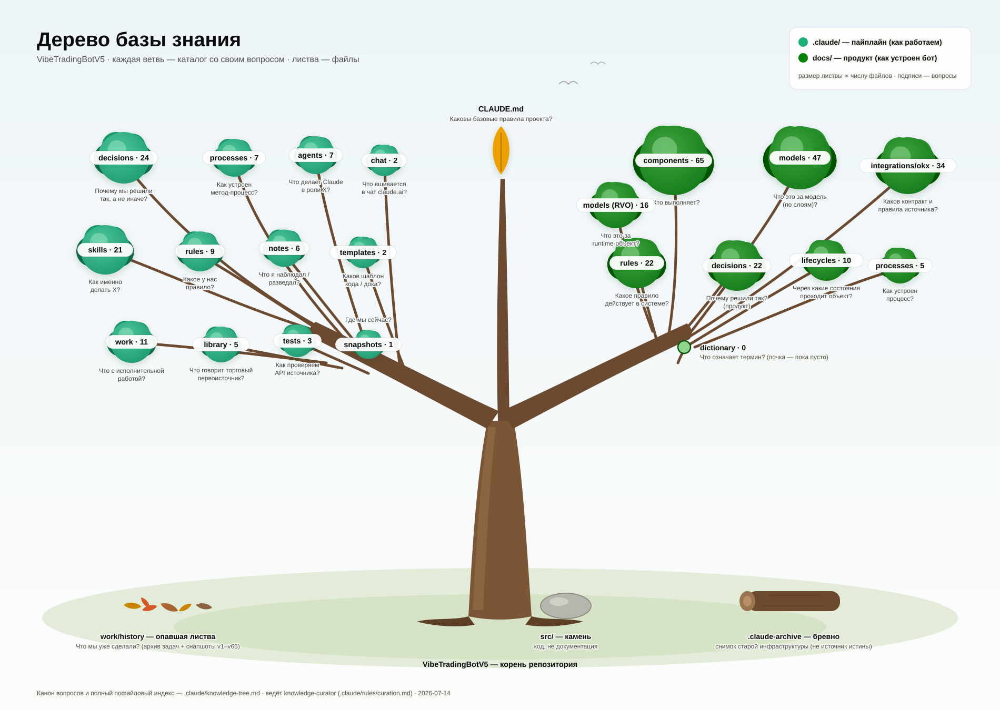

# Дерево базы знания

## На какой вопрос отвечает этот файл

На какой вопрос отвечает каждый каталог и файл базы знания.

## Как читать и вести

- У каждой папки — её главный вопрос (тип знания, канон —
  `.claude/rules/structure.md`), у каждого файла — его вопрос
  (сокращённая форма раздела «На какой вопрос отвечает этот файл»).
- Обновляется `knowledge-curator` при каждом
  добавлении/перемещении/удалении файла знания
  (`.claude/rules/curation.md`).
- Не индексируются: содержимое `work/history/` и
  `.claude-archive/` (архив), PDF в `library/trading/raw/`
  (гитигнорятся), технические файлы (`.gitkeep`, конфиги, логи),
  `src/` (код).
- Иллюстрация-обзор (то же дерево крупными мазками, счёт файлов
  по каталогам) — соседний `knowledge-tree.svg`; канон — этот
  файл, картинка обновляется вместе с ним при изменении состава
  каталогов.



## Дерево

```text
.
├── CLAUDE.md — Каковы базовые правила проекта?
├── README.md — Как поднять зависимости и куда идти за остальным?
├── .claude/ — Как устроена инфраструктура работы над проектом (пайплайн)?
│   ├── knowledge-tree.md — На какой вопрос отвечает каждый каталог и файл базы знания? (этот файл)
│   ├── agents/ — Что делает Claude в роли X?
│   │   ├── code-writer.md — Что делает Claude в роли code-writer?
│   │   ├── integrator.md — Что делает Claude в роли интегратора?
│   │   ├── knowledge-curator.md — Что делает Claude в роли knowledge-curator?
│   │   ├── reviewer.md — Что делает Claude в роли reviewer?
│   │   ├── solution-designer.md — Что делает Claude в роли solution-designer?
│   │   ├── tester.md — Что делает Claude в роли tester?
│   │   └── trading-specialist.md — Что делает Claude в роли торгового специалиста?
│   ├── chat/ — Что вшивается в чат claude.ai?
│   │   ├── chat-project-instructions.md — Каковы правила поведения Claude в чате claude.ai на этом проекте?
│   │   └── structure-digest.md — Какие типы знания есть в проекте (компактный перечень для чата)?
│   ├── decisions/ — Почему мы решили так, а не иначе? (пайплайн)
│   │   ├── acceptance-by-measurement.md — Почему по эскалации `DOCS_CHECK_30` сменена концепция приёмки правил и инструментов?
│   │   ├── chat-vs-cc-knowledge-split.md — Как разделено знание по адресатам — чат vs Claude Code?
│   │   ├── client-layer-docs.md — Где живут exchange-specific факты?
│   │   ├── closure-completeness-by-population.md — Почему по эскалации `DOCS_CHECK_31` сменена концепция полноты закрытия?
│   │   ├── collection-not-approval-artifact.md — Почему с Postman-коллекции снят статус обязательного аппрув-артефакта контура?
│   │   ├── measurement-repair-not-extension.md — Почему по эскалации С1+С4 `DOCS_CHECK_33` выбран минимальный ремонт исполнимости, а не достройка механизма до предмета?
│   │   ├── closure-mechanism-amendments.md — Почему механизмы закрытия поправлены четырьмя клаузами по итогам первого измерения?
│   │   ├── code-contact-as-gate.md — Почему по эскалации С2 `DOCS_CHECK_34` доковые циклы остановлены, а критерий выхода в `CODE` стал покомпонентным?
│   │   ├── code-templates-vs-examples.md — Почему код-шаблоны и find-code-examples — два разных инструмента?
│   │   ├── component-vs-process.md — Как различать «компонент» и «процесс» при классификации?
│   │   ├── context-cost-diet.md — Почему контекстная стоимость знаниевых файлов сокращена именно так?
│   │   ├── cross-cutting-parking.md — Как мигрируем сущность, чьё знание частично относится к другим кластерам?
│   │   ├── env-wait-deadline.md — Почему ожидание восстановления demo-контура получило срок и что происходит по его наступлении?
│   │   ├── executor-payload-file-granularity.md — Почему документация command-layer гранулируется file-per-executor?
│   │   ├── forward-notes-after-task-closure.md — Где живут форвард-заметки после закрытия задачи-источника?
│   │   ├── fsm-handler-as-component.md — Где живёт handler-per-status FSM-сущности?
│   │   ├── gating-node-closure-depth.md — Почему закрытие гейтящего узла углублено критерием глубины и мини-петлёй критики?
│   │   ├── integrator-agent.md — Почему интеграционное знание внешних источников введено именно так?
│   │   ├── knowledge-classification.md — Почему фиксация знания устроена через пятишаговую классификацию?
│   │   ├── master-index-not-fixated.md — Почему не сохраняем master-index/навигационные доки как знание?
│   │   ├── migration-triad.md — По какому принципу фиксируем фрагменты при миграции из исчезающего источника?
│   │   ├── model-granularity.md — Что считать самостоятельной доменной моделью, а что разделом родителя?
│   │   ├── model-layer-ontology.md — Как организованы доменные и интеграционные модели в docs/models/?
│   │   ├── models-core-vs-other.md — Как разделены persisted-модели на core и other?
│   │   ├── negative-statements-not-fixated.md — Почему не фиксируем утверждения «X не хранит Y»?
│   │   ├── process-materialization-criterion.md — По какому критерию кандидат в процесс материализуется файлом?
│   │   ├── product-roadmap-type.md — Почему тип «роадмап» устроен так, а не иначе?
│   │   ├── population-origin-and-code-gate.md — Почему по эскалации `DOCS_CHECK_32` сменены происхождение перечня популяции, гейт `CODE` и режим усиления измерения?
│   │   ├── recovered-deal-linkage-window-bound.md — Почему нижней границей окна линковки восстановленной сделки выбрано биржевое время открытия наблюдённой позиции?
│   │   ├── proof-method-change.md — Почему по эскалации `DOCS_CHECK_29` сменён способ доказательства, а не продолжены итерации?
│   │   ├── unorderable-fact-substitutes.md — Почему гейтящее предусловие на незаказуемом факте закрывается заменителями?
│   │   ├── risk-base-follows-balance.md — Почему база риска следует за балансом в обе стороны, а не держится невозрастающей?
│   │   ├── rule-source-of-truth.md — Где первоисточник правила, когда оно ложится в несколько мест?
│   │   ├── runtime-value-object.md — Где живут runtime-объекты компонентного слоя?
│   │   ├── source-api-target-rebase.md — Почему контур тестов API источника бьёт в сырьё, а не в нашу границу?
│   │   ├── test-knowledge-type.md — Почему per-source тест-планы живут в .claude/tests/?
│   │   └── trading-council.md — Почему торговое знание введено в пайплайн именно так?
│   ├── library/ — Что говорят внешние первоисточники?
│   │   └── trading/
│   │       ├── raw/ — Что говорит торговый первоисточник? (книги; наполняет пользователь; PDF не в git)
│   │       └── distilled/ — Что говорит торговый первоисточник? (компактно, для точечной загрузки)
│   │           ├── corpus-map.md — Как по указателю «книга + глава + страница» попасть в нужное место PDF?
│   │           ├── microstructure.md — Что говорит корпус о микроструктуре рынка?
│   │           ├── risk-and-sizing.md — Что говорит корпус о риске на сделку, сайзинге и ожидаемости?
│   │           ├── strategy-patterns.md — Что говорит корпус о типах торговых систем?
│   │           └── system-design.md — Что говорит корпус о проектировании торговых систем?
│   ├── notes/ — Что я наблюдал / разведал?
│   │   ├── 2026-05-26-обкатка-классификации-торговые-модели.md — Что наблюдал на второй обкатке классификации?
│   │   ├── 2026-05-29-ростер-тулинга-роадмап.md — Какой состав тулинга нужен для исполнения шага роадмапа?
│   │   ├── 2026-06-05-аудит-делегируемости-вопросов.md — Кто из агентов может владеть каждым открытым вопросом?
│   │   ├── 2026-06-12-okx-api-key-14d-expiry.md — Что разведано про протухание OKX API-ключей?
│   │   ├── 2026-07-02-code-review-full-codebase.md — Что показало агентское ревью всей кодовой базы?
│   │   ├── 2026-07-06-аудит-контекстной-стоимости.md — Что показал аудит контекстной стоимости знаниевых файлов?
│   │   └── 2026-08-23-разрывы-спека-кода-на-тропе-живой-сделки.md — Что разведано о фактическом состоянии контура входа и выхода в коде?
│   ├── projects/<путь-проекта>/memory/ — (артефакт харнесса: файловая память Claude Code; MEMORY.md + по файлу на факт. Не файлы знания проекта — правило «На какой вопрос отвечает» к ним не применяется.)
│   ├── processes/ — Как устроен этот методологический процесс?
│   │   ├── api-docs-completion.md — Как интеграционные доки источника доводятся до полного покрытия периметра?
│   │   ├── knowledge-classification.md — Как устроен процесс классификации знания?
│   │   ├── pipeline-shakedown.md — Как устроена обкатка агентского пайплайна?
│   │   ├── question-delegation.md — Как устроен режим автономии (кто решает развилки, что доходит до пользователя)?
│   │   ├── roadmap-step-execution.md — Как устроено исполнение одного шага роадмапа (docs-first)?
│   │   ├── source-api-testing.md — Как устроено тестирование API внешнего источника?
│   │   └── trading-library-distillation.md — Как знание из сырых книг выносится в дистиллят?
│   ├── rules/ — Какое у нас правило?
│   │   ├── carrier-levels.md — Какое правило уровней носителей для стыковых решений?
│   │   ├── classification-report.md — Какое правило отчётности при классификации знания?
│   │   ├── closed-work-transfer.md — Какое правило переноса закрытого из рабочих файлов в history/?
│   │   ├── codestyle.md — Как мы пишем код?
│   │   ├── curation.md — Какое правило регулярной курации базы знания?
│   │   ├── design-simplicity.md — Какое правило-дефолт проектирования (простота и переиспользование)?
│   │   ├── external-source-sync.md — Какое правило синхронизации файлов с внешним источником правды?
│   │   ├── naming.md — Какое правило именования файлов?
│   │   ├── parking-address.md — Какое правило выбора адресата при парковке незакрытой позиции?
│   │   ├── policy-home.md — Какое правило о единственном носителе-доме каждой политики?
│   │   ├── pre-launch-schema-changes.md — Какое правило схемных изменений, пока проект не запущен?
│   │   ├── snapshot-format.md — Какое правило формата снапшота?
│   │   ├── structure.md — Какое правило размещения знания?
│   │   └── tech-radar.md — Что мы используем при написании кода (стэк со статусами)?
│   ├── skills/ — Как именно делать X?
│   │   ├── classify-area.md — Как определить область фрагмента знания?
│   │   ├── classify-code-blocking.md — Как определить класс гейтящей находки для критерия выхода в `CODE`?
│   │   ├── classify-gap-level.md — Как определить уровень пробела у находки?
│   │   ├── closure-population.md — Как построить популяцию правила при закрытии узла?
│   │   ├── classify-theme.md — Как определить тему фрагмента внутри типа?
│   │   ├── classify-type.md — Как определить тип знания фрагмента?
│   │   ├── concept-review.md — Как сделать сквозную проверку концепции доков под шаг роадмапа?
│   │   ├── conventions-review.md — Как сделать ревью соответствия кода конвенциям?
│   │   ├── design-fork.md — Как конструктивный владелец прорабатывает развилку до вариантов с креном?
│   │   ├── disaster-review.md — Как сделать ревью поведения кода при сбоях и рестартах?
│   │   ├── divergence-review.md — Как найти расхождения утверждённого кода с доками?
│   │   ├── find-code-examples.md — Как подобрать примеры из реального кода для доков?
│   │   ├── integration-okx.md — Какова специфика источника OKX при доукомплектации доков?
│   │   ├── performance-review.md — Как сделать ревью производительности кода?
│   │   ├── place-knowledge.md — Как разместить фрагмент знания в репозитории?
│   │   ├── recognize-knowledge.md — Как опознать фрагмент, который стоит зафиксировать?
│   │   ├── reconcile-knowledge.md — Как привести доку к изменившемуся/удалённому коду?
│   │   ├── security-review.md — Как сделать ревью безопасности кода?
│   │   ├── stagnation-detection.md — Как проверить итерации прогонов шага на топтание на месте?
│   │   ├── test-code.md — Как написать код-тесты контура API источника по плану?
│   │   ├── test-collection.md — Как построить исполняемую тест-коллекцию (Postman)?
│   │   ├── test-design.md — Как построить тест-план и кейсы по сырью API источника?
│   │   ├── test-review.md — Как сделать адверсариальное ревью тест-артефактов?
│   │   ├── test-run.md — Как прогнать утверждённый тест-план?
│   │   ├── trading-review.md — Как сделать адверсариальный проход по торговой корректности?
│   │   └── update-roadmap-progress.md — Как обновить статус шага и пересчитать статус фазы?
│   ├── snapshots/ — Где мы сейчас?
│   │   └── snapshot-v115.md — Где мы сейчас? (актуальный; старые — в work/history/snapshots/)
│   ├── templates/
│   │   ├── code/ — Каков абстрактный паттерн/шаблон кода для X?
│   │   │   └── Java/Controller.md — Каков паттерн контроллера нашего API?
│   │   └── docs/ — Каков формат докового файла типа X?
│   │       ├── gap-report.md — Каков формат gap-отчёта DOCS_CHECK (поля находки, узлы, эскалации)?
│   │       └── test-plan.md — Каков формат тест-плана контура API источника?
│   ├── tests/ — Как проверяем API источника?
│   │   └── source-api/okx/
│   │       ├── plan.md — Как проверяем API OKX на уровне сырья (план + факт прогонов)?
│   │       ├── code-preconditions.md — Какие факты источника обязаны быть добыты до входа шага 7 в CODE?
│   │       ├── coverage-manifest.md — Какова полнота покрытия поверхности OKX REST API?
│   │       ├── observations/ — Что кейс наблюдал в источнике? (перечни, пишет прогон)
│   │       ├── collection.postman_collection.json — (артефакт: Postman-коллекция)
│   │       └── environment.postman_environment.json — (артефакт: Postman-окружение)
│   └── work/ — В каком состоянии исполнительная работа?
│       ├── backlog.md — Что мы планируем сделать?
│       ├── code-gate-ledger.json — Какой класс и какую диспозицию несёт каждая гейтящая находка последнего прогона?
│       ├── decision-digest.md — Какие проектные решения CC принял автономно в текущей итерации?
│       ├── 2026-08-26-step-7-question-flow-analysis.md — Какие источники дали поток ~400 вопросов на шаге 7?
│       ├── progress/ — На каком шаге мы в этой активной операции? (артефакты шага 9 фазы 1)
│       ├── questions/ — Что мы ещё не решили?
│       │   ├── open-questions.md — Что мы ещё не решили? (общие вопросы пайплайна и продукта)
│       │   └── tasks/ — Что неясно по этой конкретной активной задаче?
│       ├── roadmap/ — Куда движется продукт?
│       │   ├── roadmap.md — Какими фазами продукт движется к бизнес-ценности?
│       │   └── phase-1.md — В каком статусе каждый шаг Фазы 1?
│       └── history/ — Что мы уже сделали? (архив; содержимое не индексируется)
│           └── snapshots/ — Где мы были раньше? (снапшоты предыдущих версий; актуальный — в `.claude/snapshots/`)
├── docs/ — Как устроен продукт (продуктовая документация)?
│   ├── components/ — Кто выполняет?
│   │   ├── models/ — Что это за runtime-объект?
│   │   │   ├── CalculatedPrice.md — Что это за рассчитанная цена действия?
│   │   │   ├── CalculatedSize.md — Что это за `CalculatedSize`?
│   │   │   ├── CalculatedStrategyAction.md — Что это за `CalculatedStrategyAction`?
│   │   │   ├── CalculationContext.md — Что это за контекст расчёта одного действия?
│   │   │   ├── CalculationError.md — Что это за контролируемая ошибка расчёта?
│   │   │   ├── DealContext.md — Что это за контекст одного прохода FSM?
│   │   │   ├── HoldSignal.md — Чем описывается требуемая блокировка?
│   │   │   ├── MarketPriceData.md — Что это за runtime-цены инструмента?
│   │   │   ├── PositionStatusResolveResult.md — Что это за `PositionStatusResolveResult`?
│   │   │   ├── RiskBlockAction.md — Что это за `RiskBlockAction`?
│   │   │   ├── RiskCheckResult.md — Что это за результат одной риск-проверки?
│   │   │   ├── RiskValidationResult.md — Что это за `RiskValidationResult`?
│   │   │   ├── ServiceCommand.md — Что это за атомарная команда над runtime-сущностью?
│   │   │   ├── ServiceCommandPayload.md — Что это за параметры команды?
│   │   │   └── StrategyActionCalculationResult.md — Что это за `StrategyActionCalculationResult`?
│   │   ├── ActionRiskGate.md — Кто связывает преконтроль риска с планом действия за проход?
│   │   ├── AlgoOrderExternalStatusResolver.md — Кто переводит внешний статус standalone algo-order в доменный?
│   │   ├── AnomalyJob.md — Кто ищет нарушения базовых инвариантов системы?
│   │   ├── AttachedAlgoOrderStateResolver.md — Кто определяет доменный статус встроенной защиты?
│   │   ├── CalculationContextFactory.md — Кто собирает контекст расчёта?
│   │   ├── CancelAlgoOrderActionExecutor.md — Кто планирует CANCEL-действие над standalone algo-order за проход?
│   │   ├── CancelAlgoOrderExecutor.md — Кто исполняет `CANCEL_ALGO_ORDER_COMMAND`?
│   │   ├── CancelAttachedProtectionExecutor.md — Кто исполняет `CANCEL_ATTACHED_PROTECTION_COMMAND`?
│   │   ├── CancelOrderExecutor.md — Кто исполняет `CANCEL_ORDER_COMMAND`?
│   │   ├── CandleJob.md — Кто готовит базовые свечные данные?
│   │   ├── ClosePositionExecutor.md — Кто исполняет `CLOSE_POSITION_COMMAND`?
│   │   ├── CreateAlgoOrderActionExecutor.md — Кто планирует CREATE-действие над standalone algo-order за проход?
│   │   ├── CreateAlgoOrderExecutor.md — Кто исполняет создание отдельной условной заявки?
│   │   ├── CreateOrderActionExecutor.md — Кто планирует CREATE-действие над ordinary order за проход?
│   │   ├── CreateOrderExecutor.md — Кто исполняет создание обычной заявки?
│   │   ├── DealActiveHandler.md — Что делает обработчик активной сделки?
│   │   ├── DealContextService.md — Кто собирает контекст прохода FSM?
│   │   ├── DealExitPendingHandler.md — Что делает обработчик координированного выхода сделки?
│   │   ├── DealOpeningService.md — Кто атомарно создаёт `Deal`?
│   │   ├── DealOrchestratorJob.md — Кто сопровождает уже созданные сделки?
│   │   ├── DealStateMachine.md — Кто управляет статусами сделки?
│   │   ├── DealTrancheStateMachine.md — Кто управляет статусами транша?
│   │   ├── EntryScannerJob.md — Кто ищет возможность создать новую сделку?
│   │   ├── ErrorHandler.md — Что делает обработчик ошибочного состояния сделки?
│   │   ├── ExitActionExecutor.md — Кто исполняет действие выхода из сделки?
│   │   ├── FinalizeDealEntryExecutor.md — Кто исполняет `FINALIZE_DEAL_ENTRY_COMMAND`?
│   │   ├── FinalizeDealExitExecutor.md — Кто исполняет команду финализации штатного выхода?
│   │   ├── HoldService.md — Кто исполняет блокировку по требованию детекторов?
│   │   ├── IndicatorJob.md — Кто считает технические индикаторы?
│   │   ├── IndicatorService.md — Кто отдаёт готовые значения индикаторов?
│   │   ├── InstrumentExternalRulesDataService.md — Кто отдаёт справочные правила инструмента?
│   │   ├── InstrumentExternalRulesSyncJob.md — Кто обновляет справочные данные инструмента?
│   │   ├── IntegrationService.md — Кто является границей с биржей?
│   │   ├── KillSwitchExecutor.md — Кто исполняет аварийное снятие живого риска?
│   │   ├── KillSwitchService.md — Кто триггерит аварийное снятие риска для реактивной реакции?
│   │   ├── MarkDealClosedExecutor.md — Кто применяет терминал штатного закрытия сделки?
│   │   ├── MarkDealEmergencyClosedExecutor.md — Кто применяет аварийный терминал сделки?
│   │   ├── MarkDealErrorExecutor.md — Кто применяет ребро сделки в ошибочное состояние?
│   │   ├── MarketDataExpirationChecker.md — Кто проверяет свежесть рыночных данных?
│   │   ├── MarketPhaseResolver.md — Кто резолвит авторские правила фазы в тип фазы рынка?
│   │   ├── MarketPhaseService.md — Кто отдаёт актуальную фазу рынка?
│   │   ├── MarketPriceDataService.md — Кто отдаёт runtime-цены инструмента?
│   │   ├── MarketStructureJob.md — Кто готовит структуру рынка?
│   │   ├── MarketStructureResolver.md — Кто вычисляет структуру рынка из свечей?
│   │   ├── MarketStructureService.md — Кто отдаёт готовую структуру рынка?
│   │   ├── OrderExternalStatusResolver.md — Кто переводит внешний статус ordinary order в доменный?
│   │   ├── PositionStatusResolver.md — Кто определяет доменный статус позиции по факту её наличия?
│   │   ├── PriceCalculator.md — Кто рассчитывает цены действия?
│   │   ├── RefreshAlgoOrderExecutor.md — Кто исполняет добычу состояния условной заявки?
│   │   ├── RefreshBalanceExecutor.md — Кто исполняет `REFRESH_BALANCE_COMMAND`?
│   │   ├── RefreshBillsExecutor.md — Кто исполняет команду добычи движений средств?
│   │   ├── RefreshOrderExecutor.md — Кто исполняет добычу состояния обычной заявки?
│   │   ├── RefreshPositionExecutor.md — Кто исполняет добычу состояния позиции?
│   │   ├── RetryPolicyService.md — Кто управляет политикой повтора команд?
│   │   ├── RiskBlockResolver.md — Кто превращает результат risk-проверки в действие handler'а?
│   │   ├── RiskValidator.md — Кто проверяет рассчитанное действие по риск-политике?
│   │   ├── SafetyHoldCoordinator.md — Кто держит последовательность полной реакции холда?
│   │   ├── ServiceCommandExecutor.md — Кто исполняет атомарную команду?
│   │   ├── SizeCalculator.md — Кто рассчитывает размер действия?
│   │   ├── StrategyActionCalculator.md — Кто рассчитывает runtime-параметры действия стратегии?
│   │   ├── StrategyActionExecutor.md — Кто выдаёт следующую команду одного типа действия стратегии за проход?
│   │   ├── StrategyActionOrchestrator.md — Кто выбирает следующее действие стратегии за проход?
│   │   ├── StrategyConditionEvaluator.md — Кто проверяет применимость `StrategyCondition`?
│   │   ├── SubmitAlgoOrderExecutor.md — Кто исполняет `SUBMIT_ALGO_ORDER_COMMAND`?
│   │   ├── SubmitOrderExecutor.md — Кто исполняет отправку обычной заявки на биржу?
│   │   ├── SystemActionExecutor.md — Кто выдаёт следующую команду системного действия за проход?
│   │   ├── TrancheEntryFinalizedHandler.md — Что делает обработчик статуса подтверждённого входа транша?
│   │   ├── TrancheEntrySubmittedHandler.md — Что делает обработчик статуса отправленного входа транша?
│   │   ├── TrancheExitPendingHandler.md — Что делает обработчик статуса выхода транша?
│   │   ├── TrancheManagingHandler.md — Что делает обработчик статуса сопровождения транша?
│   │   ├── TranchePrecheckHandler.md — Что делает обработчик предвходовой проверки транша?
│   │   └── TrancheProtectionSwitchedHandler.md — Что делает обработчик статуса переключения защиты транша?
│   ├── dictionary/ — Что означает этот термин?
│   │   └── leg-term.md — Что означает термин «нога»?
│   ├── integrations/ — Что известно про источник?
│   │   └── okx/ — Что известно про источник OKX?
│   │       ├── contracts/ — Каков контракт и какие лимиты у этой операции источника?
│   │       │   ├── account-bills.md — Каков контракт операций по bill-записям аккаунта (7d, 3m, deep-архив с 2021)?
│   │       │   ├── account-config.md — Каков контракт операций конфигурации счёта?
│   │       │   ├── account-position-risk.md — Каков контракт операции `account-position-risk` — одновременный снапшот балансов и позиций аккаунта?
│   │       │   ├── account-rate-limit.md — Каков контракт операции чтения аккаунт-уровневого rate limit (fill-ratio-based лимит суб-аккаунта)?
│   │       │   ├── algo-order.md — Каков контракт операций по algo-ордеру?
│   │       │   ├── balance.md — Каков контракт операции получения баланса?
│   │       │   ├── batch-operations.md — Каков контракт batch-операций OKX по ordinary order (place / cancel / amend пакетом)?
│   │       │   ├── cancel-all-after.md — Каков контракт операции Cancel All After (серверная отмена всех pending-ордеров по таймауту)?
│   │       │   ├── candle.md — Каков контракт операций по свечам?
│   │       │   ├── fills-archive.md — Каков контракт операций для выгрузки fills > 3 месяцев?
│   │       │   ├── fills.md — Каков контракт операций по fills (3d, 3m)?
│   │       │   ├── funding-rate.md — Каков контракт операций чтения funding rate SWAP?
│   │       │   ├── index-data.md — Каков контракт операций чтения данных индекса?
│   │       │   ├── instrument.md — Каков контракт операции получения спецификации инструмента?
│   │       │   ├── insurance-fund.md — Каков контракт операции чтения баланса страхового фонда (`insurance-fund`; в офдоке — «security fund»)?
│   │       │   ├── mark-price.md — Каков контракт операций чтения mark price?
│   │       │   ├── market-price-data.md — Каков контракт операции получения тикера?
│   │       │   ├── max-size.md — Каков контракт операций оценки максимального размера ордера (`max-size`) и доступного баланса/эквити под сделку (`max-avail-size`)?
│   │       │   ├── open-interest.md — Каков контракт операции чтения открытого интереса контрактов (`open-interest`)?
│   │       │   ├── order-book.md — Каков контракт операций чтения стакана?
│   │       │   ├── order-precheck.md — Каков контракт операции order precheck (серверная пре-оценка влияния ордера на счёт до постановки)?
│   │       │   ├── order.md — Каков контракт операций по ordinary order?
│   │       │   ├── position-tiers.md — Каков контракт операции чтения позиционных тиров (лимиты размера позиции, ставки маржи и максимальное плечо по тирам)?
│   │       │   ├── position.md — Каков контракт операций по позиции?
│   │       │   ├── price-limit.md — Каков контракт операции чтения ценовых лимитов (`price-limit`)?
│   │       │   ├── public-trades.md — Каков контракт операций чтения публичных сделок инструмента?
│   │       │   ├── server-time.md — Каков контракт операции чтения серверного времени API (`public/time`)?
│   │       │   ├── service-urls.md — Какие URL у OKX по окружениям (production, demo) и регионам?
│   │       │   └── trade-fee.md — Каков контракт операции чтения ставок комиссий аккаунта (`trade-fee`)?
│   │       └── rules/ — Какое правило источника OKX?
│   │           ├── adapter-constants.md — Какие константы OKX adapter выставляет сам, не из доменных моделей?
│   │           ├── cash-flow-categories.md — Как тип движения счёта OKX относится к экономике сделки?
│   │           ├── client-id-marker.md — Какое правило источника делает нашу заявку опознаваемой на стороне биржи?
│   │           ├── reduce-only-invariant.md — Какой invariant OKX adapter проверяет по `reduceOnly` факту?
│   │           ├── timeframe-constants.md — Какое у нас правило обращения со строками таймфреймов OKX?
│   │           └── ws-limits.md — Какие лимиты у WebSocket-соединений источника?
│   ├── lifecycles/ — Через какие состояния проходит этот объект?
│   │   ├── AlgoOrder.md — Через какие состояния проходит `AlgoOrder`?
│   │   ├── AnomalyReport.md — Через какие состояния проходит `AnomalyReport`?
│   │   ├── CandleGroup.md — Через какие состояния проходит загрузка свечей группы (`CandleGroup`)?
│   │   ├── Deal.md — Через какие состояния проходит `Deal`?
│   │   ├── DealTranche.md — Через какие состояния проходит `DealTranche`?
│   │   ├── DealActionState.md — Через какие состояния проходит исполнение действия?
│   │   ├── Instrument.md — Через какие состояния проходит онбординг инструмента (`Instrument`) в шаге 1?
│   │   ├── Order.md — Через какие состояния проходит `Order` вместе со своей встроенной защитой?
│   │   ├── Position.md — Через какие состояния проходит `Position`?
│   │   └── Strategy.md — Через какие состояния проходит `Strategy`?
│   ├── models/ — Какие у нас модели и как они переходят между слоями?
│   │   ├── api/ — Что это за модель API нашего сервиса?
│   │   │   └── OkxRawApiRequest.md — Какие поля у `OkxRawApiRequest` — конверта запроса generic-эндпоинта `POST /api/proxy/okx/raw`?
│   │   ├── domain/ — Какие у нас доменные модели?
│   │   │   ├── aggregate/ — Что это за сущность без биржевой привязки, нужная для торговли?
│   │   │   │   ├── Deal.md — Что это за сущность `Deal`?
│   │   │   │   ├── DealTranche.md — Что это за сущность `DealTranche`?
│   │   │   │   └── Strategy.md — Что это за сущность `Strategy`?
│   │   │   ├── core/ — Что это за торговая модель с биржевым воплощением?
│   │   │   │   ├── AlgoOrder.md — Что это за сущность `AlgoOrder` — отдельная условная заявка сделки?
│   │   │   │   ├── BalanceContainer.md — Что это за сущность `BalanceContainer`?
│   │   │   │   ├── Exchange.md — Что это за сущность `Exchange`?
│   │   │   │   ├── Instrument.md — Что это за сущность `Instrument`?
│   │   │   │   ├── Order.md — Что это за сущность `Order`?
│   │   │   │   └── Position.md — Что это за сущность `Position`?
│   │   │   └── other/ — Что это за прочая хранимая модель?
│   │   │       ├── AnomalyReport.md — Что это за модель `AnomalyReport`?
│   │   │       ├── Auditable.md — Какие общие поля аудита несут доменные сущности?
│   │   │       ├── Candle.md — Что это за доменная модель `Candle`?
│   │   │       ├── CandleGroup.md — Что это за доменная модель `CandleGroup`?
│   │   │       ├── DealActionState.md — Что это за модель `DealActionState` — строка исполнения действия?
│   │   │       ├── DealCashFlow.md — Что это за модель `DealCashFlow`?
│   │   │       ├── IndicatorValue.md — Что это за модель `IndicatorValue`?
│   │   │       ├── InstrumentExternalRules.md — Что это за модель `InstrumentExternalRules` — справочные правила инструмента?
│   │   │       ├── MarketPhase.md — Что это за `MarketPhase`?
│   │   │       ├── MarketStructure.md — Что это за модель `MarketStructure`?
│   │   │       └── TradeFeeRate.md — Что это за модель `TradeFeeRate` — ставка торговой комиссии?
│   │   ├── integrations/ — Какие поля у нативной модели источника?
│   │   │   └── okx/ — Какие поля у нативной модели источника OKX?
│   │   │       ├── AccountBillOkxResponse.md — Какие поля у OKX bill response — одной записи денежного движения по торговому аккаунту?
│   │   │       ├── AlgoOrderOkxResponse.md — Какие поля у нативной модели условной заявки источника?
│   │   │       ├── BalanceOkxResponse.md — Какие поля у нативной модели баланса источника?
│   │   │       ├── CandleOkxResponse.md — Какие поля у нативной модели свечи источника?
│   │   │       ├── FillOkxResponse.md — Какие поля у OKX fill response (одна сделка / одно исполнение)?
│   │   │       ├── FillsArchiveOkxResponse.md — Какие поля у нативных моделей выгрузки сделок исполнения источника?
│   │   │       ├── InstrumentOkxResponse.md — Какие поля у нативной модели инструмента источника?
│   │   │       ├── OrderOkxResponse.md — Какие поля у нативной модели заявки источника?
│   │   │       ├── PositionOkxResponse.md — Какие поля у нативной модели позиции источника?
│   │   │       ├── PositionsHistoryOkxResponse.md — Какие поля у нативной модели истории позиций источника?
│   │   │       ├── TickerOkxResponse.md — Какие поля у нативной модели котировки источника?
│   │   │       └── TradeFeeOkxResponse.md — Какие поля у OKX trade-fee response — ответа со ставками комиссий комиссионных групп аккаунта?
│   │   └── mapping/ — Как сущность переходит между слоями?
│   │       ├── AlgoOrder.md — Как `AlgoOrder` переходит между слоями?
│   │       ├── Balance.md — Как баланс переходит между слоями?
│   │       ├── Candle.md — Как свеча переходит между слоями?
│   │       ├── DealCashFlow.md — Как движение средств источника переходит в `DealCashFlow`?
│   │       ├── Instrument.md — Как `Instrument` переходит между слоями?
│   │       ├── InstrumentExternalRules.md — Как справочные правила инструмента переходят между слоями?
│   │       ├── MarketPriceData.md — Как runtime-цены переходят между слоями?
│   │       ├── Order.md — Как `Order` переходит между слоями?
│   │       ├── Position.md — Как `Position` переходит между слоями?
│   │       ├── PositionCloseResult.md — Как положение закрытой позиции источника переходит в `Position`?
│   │       ├── Strategy.md — Как `Strategy` переходит между слоями?
│   │       ├── TimeFrame.md — Как таймфрейм переходит между слоями?
│   │       └── TradeFeeRate.md — Как ставка комиссии источника переходит в `TradeFeeRate`?
│   ├── processes/ — Как устроен этот процесс?
│   │   ├── candle-loading.md — Как устроен процесс добычи и поддержания целостности свечной истории?
│   │   ├── deal-management.md — Как устроен процесс сопровождения сделки во времени?
│   │   ├── fsm-execution-layering.md — Как разложены слои исполнения сделки от петли до биржевого вызова?
│   │   ├── market-data-calculation.md — Как устроен процесс вычисления производных рыночных данных (индикаторы / структура / фаза) поверх загруженных свечей?
│   │   ├── risk-evaluation.md — Как устроен процесс оценки риска?
│   │   └── strategy-action-calculation.md — Как устроен процесс расчёта параметров одного `StrategyAction`?
│   ├── rules/ — Какое правило действует в системе?
│   │   ├── absent-value-semantics.md — Как выражается отсутствие значения у признака?
│   │   ├── ack-not-runtime-truth.md — Какое правило системы запрещает считать ACK биржи фактом о состоянии сущности?
│   │   ├── audit-not-runtime-source.md — Какое правило запрещает управляющей логике читать историю, чтобы решить, что делать дальше?
│   │   ├── command-lifecycle.md — Каков жизненный цикл `ServiceCommand`?
│   │   ├── condition-ruletype-granularity.md — Когда именованный тип правила условия оправдан?
│   │   ├── controlled-exchange-exceptions.md — Какие категории контролируемых исключений существуют на границе с биржей?
│   │   ├── deal-without-operations.md — Как определяется, что по сделке не было операций на бирже?
│   │   ├── error-handling-policy.md — Какова политика обработки ошибок?
│   │   ├── exchange-hold.md — Каковы биржевые safety-состояния?
│   │   ├── execution-hierarchy.md — Какова иерархия уровней исполнения торговли?
│   │   ├── exit-teardown-order.md — В каком порядке идёт выход из сделки?
│   │   ├── external-status-resolution.md — Как резолвится сырой статус источника?
│   │   ├── idempotency-via-unique.md — Чем обеспечивается идемпотентность хранимых сущностей?
│   │   ├── instrument-hold.md — Какое правило определяет холд по одному инструменту?
│   │   ├── live-risk-protection.md — Какой инвариант системы запрещает живой риск без защиты?
│   │   ├── manual-halt.md — Какое у нас правило ручного управления safety-остановкой?
│   │   ├── market-data-freshness.md — Как определяется свежесть рыночных данных?
│   │   ├── market-data-retention.md — Какое у нас правило хранения результатов расчёта рыночных данных?
│   │   ├── no-partial-close.md — Какими формами выражается закрытие позиции?
│   │   ├── persistence-representation.md — Какое у нас правило представления доменных структур в базе?
│   │   ├── loss-streak-halt.md — Что останавливает торговлю после того, как допустимая потеря реализовалась?
│   │   ├── pnl-reconciliation.md — Как сверяется заголовочный результат сделки с разбивкой движений?
│   │   ├── raw-exchange-dto-boundary.md — Какое правило ограничивает распространение сырых DTO источника по слоям?
│   │   ├── replace-not-amend.md — Как система ремоделирует уже стоящие на бирже сущности?
│   │   ├── risk-policy.md — Какой риск система допускает на сделку?
│   │   ├── risk-validator-scope.md — Для каких действий вызывается `RiskValidator`?
│   │   ├── runtime-error-classification.md — Как классифицируются неожиданные runtime-ошибки?
│   │   ├── strategy-condition-contract.md — Как автор стратегии записывает условие?
│   │   ├── strategy-step-once-per-episode.md — Какое правило определяет, сколько раз применяется шаг стратегии?
│   │   ├── strategy-validation.md — Что проверяется при создании стратегии?
│   │   ├── time-utc.md — Какое у нас правило работы со временем?
│   │   ├── trading-configuration-ownership.md — Кому принадлежит настраиваемое в торговле?
│   │   ├── trading-constraints.md — Каковы ограничения торгового контура?
│   │   └── writer-named-for-every-value.md — Какое правило требует называть писателя для каждого значения и перехода?
│   ├── spec/ — Чему равна эта величина или предикат и на каких примерах это проверено?
│   │   ├── cash-flow-linkage.json — По какому предикату движение средств привязывается к сделке?
│   │   ├── algo-order-lifecycle.json — Какие переходы состояний допустимы у отдельной условной заявки?
│   │   ├── deal-context-load.json — Какой объём графа сделки обязан быть загружен?
│   │   ├── deal-lifecycle.json — Какие переходы статуса сделки допустимы?
│   │   ├── deal-tranche-lifecycle.json — Какие переходы статуса транша допустимы?
│   │   ├── deal-risk-numbers.json — Чему равны четыре числа риска сделки?
│   │   ├── deal-result.json — Чему равен итоговый результат сделки?
│   │   ├── external-status-resolution.json — Во что резолвится сырой статус источника?
│   │   ├── loss-streak-halt.json — Останавливается ли торговля после серии убытков?
│   │   ├── manual-halt.json — В какое состояние ручная операция приводит объект блокировки?
│   │   ├── market-data-freshness.json — Свежи ли рыночные данные?
│   │   ├── market-phase-condition.json — Истинен ли предикат фазы рынка внутри прохода сделки?
│   │   ├── order-lifecycle.json — Какие переходы состояний допустимы у заявки вместе с её встроенной защитой?
│   │   ├── order-sizing.json — Какой размер получает действие?
│   │   ├── pnl-reconciliation.json — Сошлась ли сверка P&L?
│   │   ├── position-close-outcome.json — Во что резолвится сырой тип закрытия позиции?
│   │   ├── protection-coverage.json — Каково покрытие защиты транша?
│   │   ├── risk-at-stop.json — Чему равен убыток на уровне остановки убытка в расчёте на единицу экспозиции?
│   │   ├── risk-limits.json — Выполняются ли потолки риска?
│   │   ├── stop-distance.json — Допустим ли объявленный уровень остановки убытка?
│   │   ├── strategy-reference.json — Проходит ли эталонная стратегия репозитория действующие требования к дереву стратегии?
│   │   └── strategy-walkthrough.json — Держится ли инвариант покрытия на каждом шаге прохода эталонного транша?
│   └── concept.md — Из каких принципов выведена система?
├── src/ — (Код, не документация.)
└── .claude-archive/ — (Архив старой инфраструктуры; не место для новых файлов.)
```
