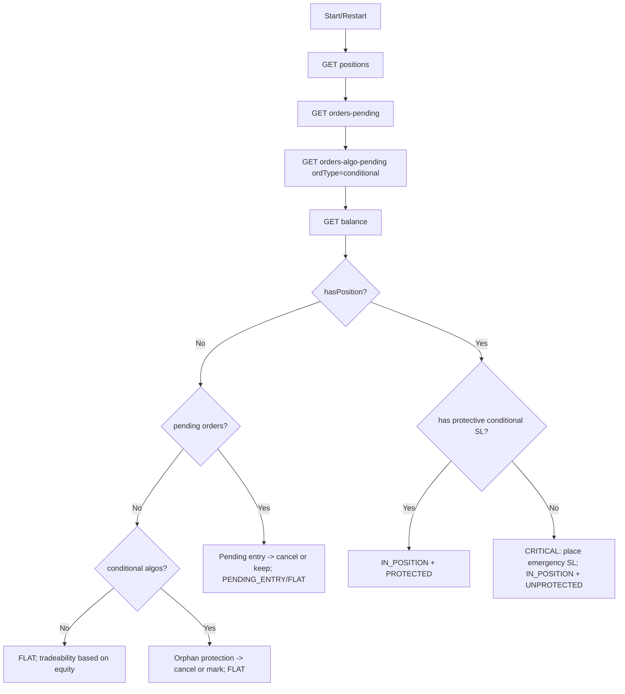

# Scenario 0 — Start/Restart: Reconcile (restore the “picture of the world”)

This document describes **Scenario 0** (bot start/restart) for OKX trading:
- detect **open positions**
- detect **pending regular orders**
- detect **pending algo orders** (for now we focus on `ordType=conditional`)
- detect **available equity** (balance)
- decide **what to do** in each branch

> Assumptions (project):
> - instrument: `ETH-USDT-SWAP`
> - leverage ≤ x10, **isolated** margin (strategy/risk config)
> - risk per trade ≤ 1% (depends on equity)
> - in this phase we **do NOT trade**, we only reconcile state
> - we treat `conditional` algo orders as “our SL/TP protection primitive”

---

## Goals

1. **Safety:** never leave a position without protection (at least a Stop/SL).
2. **Correctness after restart:** bot state must match OKX state.
3. **Idempotency:** running reconcile multiple times yields the same resulting internal state.
4. **Observability:** create a clear decision log (“why we concluded FLAT / IN_POSITION / BLOCKED”).

---

## Inputs

- OKX credentials: `apiKey`, `secretKey`, `passphrase`, `baseUrl`
- Instrument: `ETH-USDT-SWAP`
- Mode/risk: `isolated`, leverage cap, risk-per-trade%
- Strategy policies:
  - `startup_policy.cancel_orphan_orders` (bool)
  - `startup_policy.cancel_orphan_algos` (bool)
  - `startup_policy.require_protective_sl` (bool)
  - `startup_policy.min_equity_to_trade` (e.g., > 0)

---

## API calls used (Scenario 0)

Order of calls is deliberate: **positions → orders → algos → balance**.

1) **Positions**
- `GET /api/v5/account/positions`
- recommended filter: `?instId=ETH-USDT-SWAP`

2) **Pending regular orders**
- `GET /api/v5/trade/orders-pending`
- recommended filter: `?instId=ETH-USDT-SWAP`

3) **Pending algo orders (conditional only)**
- `GET /api/v5/trade/orders-algo-pending`
- required params: `ordType=conditional`
- optional filter: `&instId=ETH-USDT-SWAP`

4) **Balance / equity**
- `GET /api/v5/account/balance`
- recommended filter: `?ccy=USDT`

---

## State model (suggested)

Internal “reconcile result considerers”:

- `AccountTradeability`
  - `TRADABLE`
  - `NO_FUNDS`
  - `READONLY_ERROR` (auth/time drift/permissions)
  - `DEGRADED` (partial data, non-critical endpoint failing)

- `InstrumentState` for `ETH-USDT-SWAP`
  - `FLAT` (no position)
  - `IN_POSITION` (position exists)
  - `PENDING_ENTRY` (no position but there is an entry order)
  - `PENDING_EXIT_ONLY` (position exists and only reduce-only orders exist)
  - `UNKNOWN` (inconsistent/unhandled)

- `ProtectionState`
  - `PROTECTED` (has a valid SL `conditional` algo for the position)
  - `UNPROTECTED` (position exists but no valid SL)
  - `ORPHAN_PROTECTION` (no position but there are protection algos)

---

## Reconcile algorithm (step-by-step)

### Step 1 — Fetch positions
Call:
- `GET /account/positions?instId=ETH-USDT-SWAP`

Derive:
- `hasPosition` (true/false)
- if true: `posSide`, `sz`, `avgPx`, `mgnMode` (expect `isolated`), etc.

### Step 2 — Fetch pending regular orders
Call:
- `GET /trade/orders-pending?instId=ETH-USDT-SWAP`

Derive:
- `pendingOrders` list
- `hasEntryOrders` (orders that increase exposure)
- `hasExitOrders` (reduce-only / close logic, if applicable)
- `hasUnexpectedOrders` (not matching your strategy tags/ids)

### Step 3 — Fetch pending algo orders (conditional)
Call:
- `GET /trade/orders-algo-pending?ordType=conditional&instId=ETH-USDT-SWAP`

Derive:
- `conditionalAlgos` list
- identify which are “protection for the current position”
  - prefer by your own stored reference: `algoId` / `clOrdId` mapping, if you have it
  - otherwise infer by `side/posSide`, size, reduce-only semantics

### Step 4 — Fetch balance/equity
Call:
- `GET /account/balance?ccy=USDT`

Derive:
- `equity_usdt` (use `totalEq` as a baseline)
- `tradeable = equity_usdt > 0` and other conditions

---

## Branching logic: what to do

### Branch A — No position, no orders, no algos
Conditions:
- `hasPosition = false`
- `pendingOrders = []`
- `conditionalAlgos = []`

Action:
- Set `InstrumentState = FLAT`
- Set `AccountTradeability` based on equity:
  - `NO_FUNDS` if equity is 0
  - otherwise `TRADABLE`
- Done.

---

### Branch B — No position, but there are pending entry orders
Conditions:
- `hasPosition = false`
- `hasEntryOrders = true`

Actions (choose policy):
- **Conservative startup** (recommended):
  - cancel those orders (to avoid surprise fills after restart)
  - set `InstrumentState = FLAT` after cancellation confirmed
- **Resume mode** (advanced):
  - keep orders, set `InstrumentState = PENDING_ENTRY`
  - watch them until they fill/cancel

Notes:
- If you keep orders, your trailing/SL logic must start only after fill.

---

### Branch C — No position, but there are conditional algos (orphan protection)
Conditions:
- `hasPosition = false`
- `conditionalAlgos not empty`

Actions:
- If `startup_policy.cancel_orphan_algos = true`: cancel them
- Otherwise: mark `ProtectionState = ORPHAN_PROTECTION` and alert/log
- Set `InstrumentState = FLAT`

Why:
- orphan SL/TP algos can unexpectedly create orders or block future logic.

---

### Branch D — Position exists and protection exists (happy path)
Conditions:
- `hasPosition = true`
- there is at least one valid `conditional` algo that acts as SL protection

Actions:
- Set `InstrumentState = IN_POSITION`
- Set `ProtectionState = PROTECTED`
- Start “PositionMonitor” logic (outside Scenario 0) which will:
  - compute desired SL by strategy trailing rules
  - amend/cancel+create the conditional SL when tightening is required

---

### Branch E — Position exists but no protection (critical)
Conditions:
- `hasPosition = true`
- `conditionalAlgos = []` (or none that matches protection)

Actions (fail-safe):
1) Set `ProtectionState = UNPROTECTED`
2) If `startup_policy.require_protective_sl = true`:
   - place emergency SL immediately (as conditional algo)
   - until SL is confirmed: **do not place new orders**
3) Record a “critical” decision log event.

Notes:
- Even if your strategy usually adds SL later, on restart you want a safe default.

---

### Branch F — Position exists and there are pending entry orders
Conditions:
- `hasPosition = true`
- `hasEntryOrders = true`

Interpretation:
- This is usually **unexpected** for a single-position strategy (can cause pyramiding).

Actions:
- Conservative: cancel entry orders
- If your strategy supports pyramiding: keep but verify risk constraints
- Always keep/restore SL protection first.

---

### Branch G — Inconsistent / unknown
Examples:
- multiple conflicting algos
- position exists but margin mode is not `isolated`
- instrument mismatch
- unexpected order types

Actions:
- Set `InstrumentState = UNKNOWN`
- Disable trading (`AccountTradeability = DEGRADED` or `READONLY_ERROR`)
- Emit alert/log with full snapshot for manual review

---

## Mermaid flow (readable decision tree)

---

## Error handling / retries (recommended)

### Endpoint failures
- If auth/signature error: `READONLY_ERROR` (do not trade)
- If transient network/5xx: retry with backoff; if still failing → `DEGRADED`

### Time drift
- If OKX complains about timestamp: sync system time (NTP) and retry.

### Idempotency & journaling
- Save a “ReconcileRun” record with:
  - timestamp
  - instrument
  - snapshots: positions/orders/algos/balance (or hashes)
  - resulting states and chosen actions (e.g., cancellations)
- Ensure cancel actions are idempotent (same ordId/algoId can be retried).

---

## Notes specific to “conditional only”
- `orders-algo-pending` requires `ordType`. In this document we only use `ordType=conditional`.
- Later you can expand Scenario 0 by adding `ordType=move_order_stop`, `oco`, `trigger`.

---

## Done criteria for Scenario 0
Scenario is completed when:
- internal state is one of:
  - `FLAT` OR `IN_POSITION`
- and if `IN_POSITION`, then `ProtectionState != UNPROTECTED` (or emergency SL placement started)
- `AccountTradeability` is computed (TRADABLE / NO_FUNDS / READONLY_ERROR / DEGRADED)

